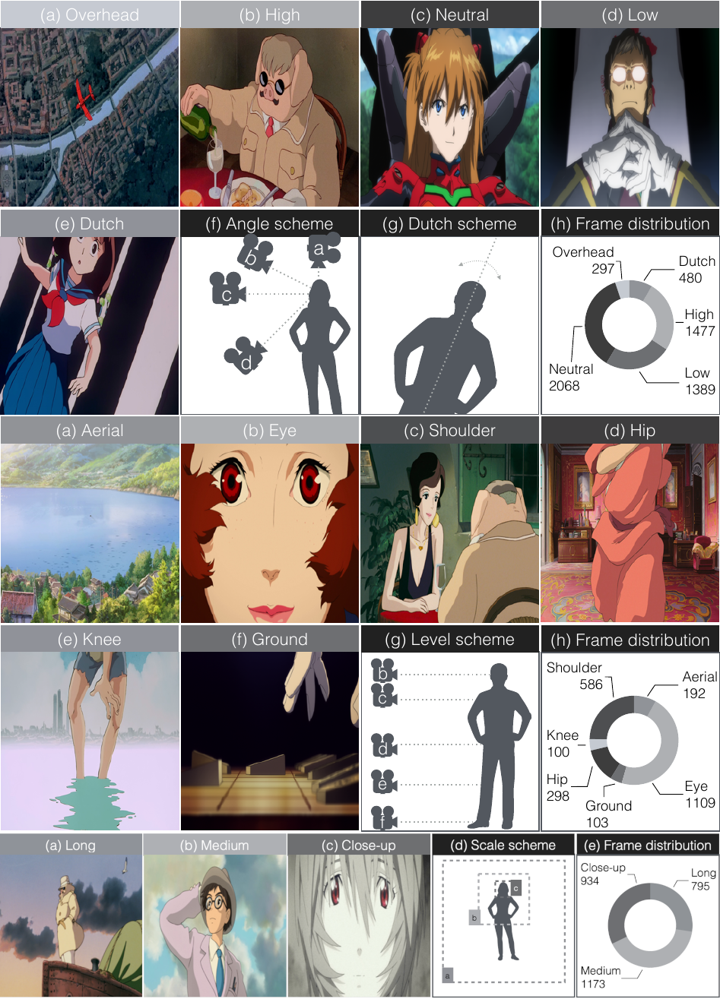
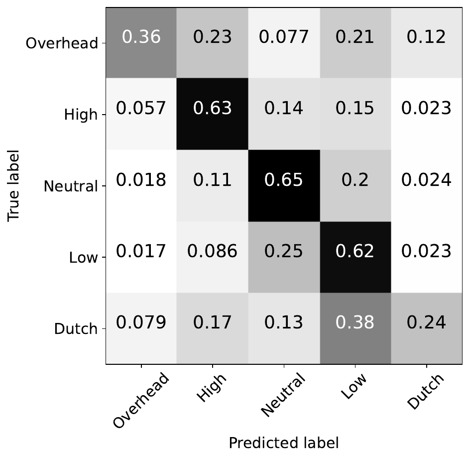
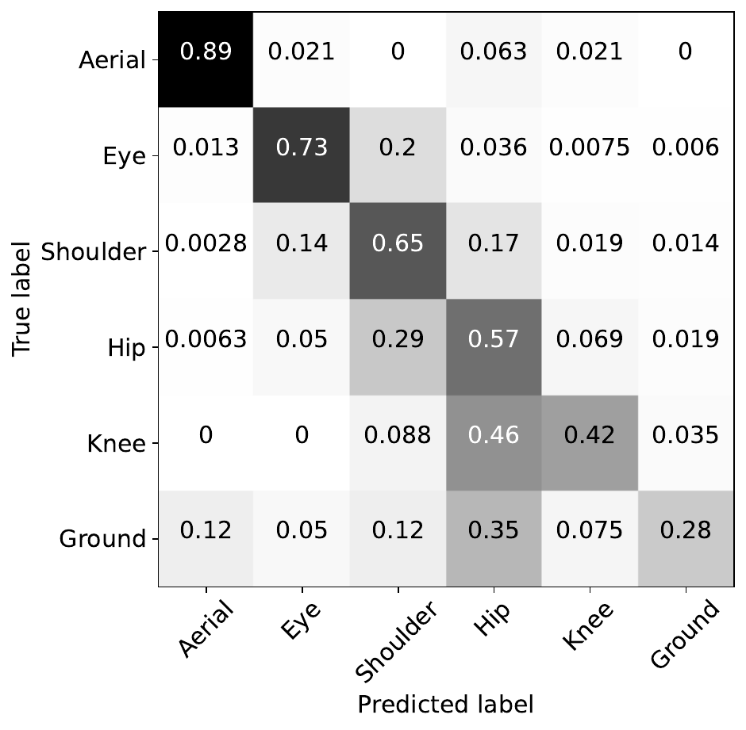
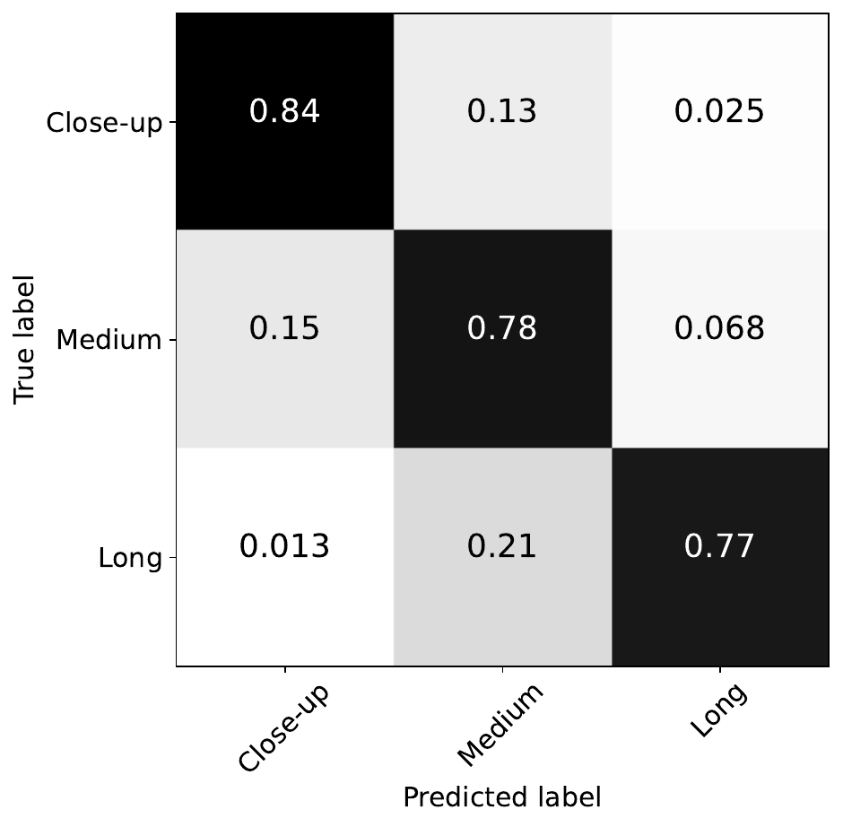
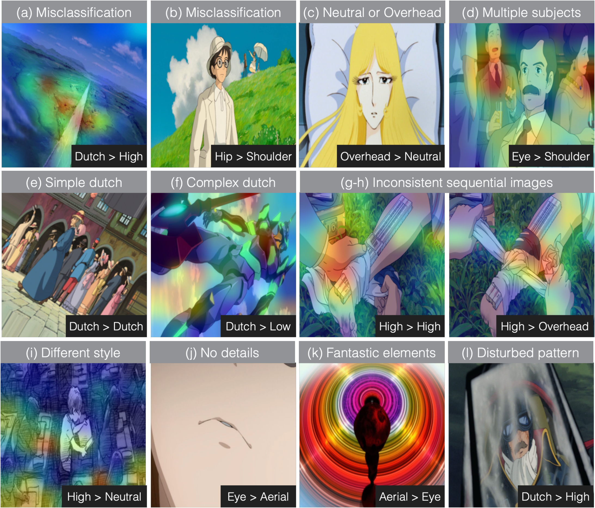
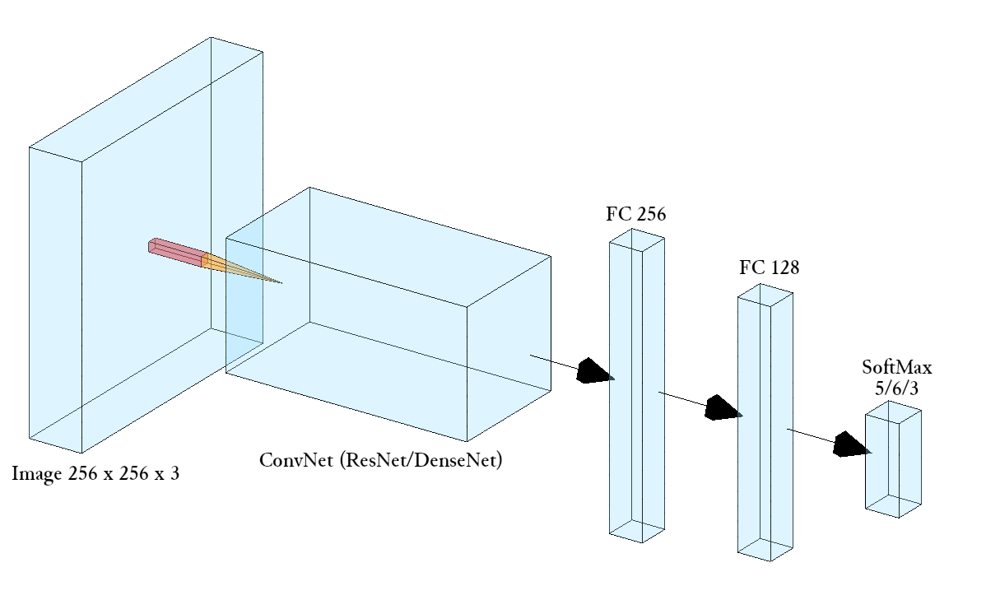

<!-- #region -->
# Camera Feature Recognition

## What is the aim?
<div class="columns is-mobile is-centered is-vcentered">
  <div class="column is-4">
    <span>
    The position, orientation, and the distance of the camera in relation to the subject(s) in a movie scene, namely <i>camera level, camera angle</i>, and <i>shot scale</i>, are essential features in the film-making process due to their influence on the viewer's perception of the scene.
    Since animation techniques exploit drawings or computer graphics objects for making films instead of camera shooting, the automatic understanding of such ''virtual camera'' features appears harder if compared to live-action movies. <br/>    
    In this work we propose a new dataset of frames from popular Japanese animated films, and with this we fine-tune pre-trained Convolutional Neural Networks for the task of automatic classification of camera features. The developed models will be useful in conducting automated movie annotation for a wide range of applications, such
    as in stylistic analysis, video recommendation, and studies in media psychology.
    </span>
  </div>
  <div class="column">
    
  </div>
</div>

[Paper (preprint)](#TBD){: .button}


<!-- #endregion -->

## Dataset <!-- #region -->
We collect a large dataset of shot frames (more than <b>17000</b>) from animation movies directed by some of the most important directors of Japanese animation such as Hayao Miyazaki, Hideaki Anno and Mamoru Oshii and directed between 1982 and 2021.
Each frame is manually annotated into the corresponding classes for camera angle (Overhead, High, Neutral, Low and Dutch), camera level (Aerial, Eye, Shoulder, Hip, Knee and Ground), and shot scale (Long, Medium and Close-up).
Manual annotations on frames are provided by two independent coders, while a third person checks their coding and makes decisions in cases of disagreement.

*Below a list of the movies used as sources for the annotated frames. We use twelve movies for training, except for Shot Scale where we use only three movies, considering the number of frames obtained sufficient for the task, while the other three are used for testing, split into the two Tables.*

<details>
 <summary> Movies Datasets (click to open)</summary>
    <table>
      <caption>Training movies</caption>
      <thead>
        <tr>
          <th rowspan="2">Director</th>
          <th rowspan="2">Movie title</th>
          <th rowspan="2">Year</th>
          <th rowspan="2">Duration (minutes)</th>
          <th colspan="3" style="text-align: center">Annotated Frames</th>
        </tr>
        <tr>
          <th>Camera Angle</th>
          <th>Camera Level</th>
          <th>Shot Scale</th>
        </tr>
      </thead>
      <tbody>
        <tr>
          <td rowspan="3">Hideaki Anno</td>
          <td>Evangelion: 1.11 You Are (Not) Alone</td>
          <td>2007</td>
          <td>98</td>
          <td>563</td>
          <td>193</td>
          <td>-</td>
        </tr>
        <tr>
          <td>Evangelion: 2.22 You Can (Not) Advance</td>
          <td>2009</td>
          <td>108</td>
          <td>601</td>
          <td>255</td>
          <td>-</td>
        <tr>
          <td>Evangelion: 3.333 You Can (Not) Redo</td>
          <td>2012</td>
          <td>96</td>
          <td>460</td>
          <td>219</td>
          <td>1181</td>
        <tr>
          <td rowspan="2">Mamoru Oshii</td>
          <td>Urusei Yatsura 2: Beautiful Dreamer</td>
          <td>1984</td>
          <td>101</td>
          <td>439</td>
          <td>159</td>
          <td>-</td>
        </tr>
        <tr>
          <td>Ghost in the Shell</td>
          <td>1995</td>
          <td>83</td>
          <td>346</td>
          <td>202</td>
          <td>620</td>
        </tr>
        <tr>
          <td rowspan="3">Hayao Miyazaki</td>
          <td>Porco Rosso</td>
          <td>1992</td>
          <td>102</td>
          <td>387</td>
          <td>226</td>
          <td>1133</td>
        </tr>
        <tr>
          <td>Spirited Away</td>
          <td>2001</td>
          <td>125</td>
          <td>357</td>
          <td>227</td>
          <td>-</td>
        </tr>
        <tr>
          <td>Howl's moving castle</td>
          <td>2004</td>
          <td>119</td>
          <td>865</td>
          <td>255</td>
          <td>-</td>
        </tr>
        <tr>
          <td>Isao Takahata</td>
          <td>The Tale of the Princess Kaguya</td>
          <td>2013</td>
          <td>137</td>
          <td>224</td>
          <td>119</td>
          <td>-</td>
        </tr>
        <tr>
          <td>Hiroyuki Imaishi</td>
          <td>Promare</td>
          <td>2019</td>
          <td>111</td>
          <td>487</td>
          <td>169</td>
          <td>-</td>
        </tr>
        <tr>
          <td>Makoto Shinkai</td>
          <td>Your Name.</td>
          <td>2016</td>
          <td>112</td>
          <td>430</td>
          <td>219</td>
          <td>-</td>
        </tr>
        <tr>
          <td>Satoshi Kon</td>
          <td>Paprika</td>
          <td>2006</td>
          <td>90</td>
          <td>335</td>
          <td>135</td>
          <td>-</td>
        </tr>
      </tbody>    
    </table>
    <table>
    <caption>Testing movies</caption>
      <thead>
        <tr>
          <th rowspan="2">Director</th>
          <th rowspan="2">Movie title</th>
          <th rowspan="2">Year</th>
          <th rowspan="2">Duration (minutes)</th>
          <th colspan="3" style="text-align: center">Annotated Frames</th>
        </tr>
        <tr>
          <th>Camera Angle</th>
          <th>Camera Level</th>
          <th>Shot Scale</th>
        </tr>
      </thead>
      <tbody>
        <tr>
          <td>Hideaki Anno</td>
          <td>Evangelion: 3.0+1.01 Thrice Upon A Time</td>
          <td>2021</td>
          <td>155</td>
          <td>1474</td>
          <td>644</td>
          <td>1289</td>
        </tr>
        <tr>
          <td>Hayao Miyazaki</td>
          <td>The Wind Rises</td>
          <td>2013</td>
          <td>126</td>
          <td>981</td>
          <td>385</td>
          <td>839</td>
        <tr>
          <td>Tomoharu Katsumata</td>
          <td>Arcadia of My Youth</td>
          <td>1982</td>
          <td>130</td>
          <td>493</td>
          <td>353</td>
          <td>546</td>
        </tr>
      </tbody>    
    </table>
    <table>
    <caption>Testing movies</caption>
      <thead>
        <tr>
          <th>Camera features</th>
          <th>Training</th>
          <th>Testing</th>
        </tr>
      </thead>
      <tbody>
        <tr>
          <td>Camera Angle</td>
          <td>5494</td>
          <td>2948</td>
        </tr>
        <tr>
          <td>Camera Level</td>
          <td>2388</td>
          <td>1382</td>
        </tr>
        <tr>
          <td>Shot Scale</td>
          <td>2934</td>
          <td>2674</td>
        </tr>
      </tbody>    
    </table>
</details>

*Below the tree structure of the folders making up the datasets, which is identical for both the train dataset and the test dataset. Each **frame** file (`{$code_name_movie}_{$num_frame}.png`) is a PNG image of size 256 x 256.*
<details>
    <summary> Tree structure Datasets (click to open)</summary>
    <ul id="Datasets">
        <li><span class="caret">train/test</span>
            <ul class="train1">
                <li>angle
                    <ul class="angletrain1">
                        <li>dutch
                            <ul class="dutchtrain1">
                                <li>dutch_frame_01</li>
                                <li>dutch_frame_02</li>
                                <li>...</li>
                        </ul></li>
                        <li>high<ul class="hightrain1">
                                <li>high_frame_01</li>
                                <li>...</li>
                        </ul></li>
                        <li>low</li>
                        <li>neutral</li>
                        <li>overhead</li>
                </ul></li>
                <li>level
                    <ul class="angletrain1">
                        <li>aerial</li>
                        <li>eye</li>
                        <li>ground</li>
                        <li>hip</li>
                        <li>knee</li>
                        <li>shoulder</li>
                </ul></li>
                <li>scale
                    <ul class="angletrain1">
                        <li>CS</li>
                        <li>LS</li>
                        <li>MS</li>
                </ul></li>
        </ul></li>
    </ul>
</details>
<br />
<!-- #endregion -->

<!-- #region -->
<section class="showcase">
    <div class="showcase-content">
    <h4 id="get-the-data">Get the data</h4>

Please read the Research Use Agreement provided below. 
        
<pre class="highlight" style="white-space: pre-wrap">
<b>Dataset Research Use Agreement</b>

<div style="text-align: left">
<b>Premise</b>: this project involves a set of activities aiming at AI-driven interpretation of cinematic data. The research activities are conducted by the Department of Information  Engineering (DII) of the University of Brescia, Brescia, Italy (UniBS).
The dataset is a collection of images and related data and metadata that is made accessible for Research use only, starting from this website and after acceptance of the following terms of use. 

<b>By registering for downloads, you are agreeing to this:</b>

1.	Permission is granted to view and use the Dataset without charge for research purposes only. Its sale is prohibited. Any non-academic research use need to be evaluated case by case by the DII. If you intend to use this Dataset for any non-academic research use, you need to communicate it describing the intended use and receive approval by the DII.
2.	In agreement with the mission of UniBS to promote the publication of scientific knowledge as open data, any computational model or algorithm that have used the Dataset and is publicly referenced (e.g. in a publication etc..) is suggested to be shared including the code and model weights and any case will give appropriate credit by correctly citing the CineScale project scientific papers, but not in any way that suggests that UniBS endorses you or your use.
3.	Other than the rights granted herein, UNIBS retains all rights, title, and interest in the Dataset.
4.	You may make a verbatim copy of the "CineScale Dataset" for uses as permitted in this Research Use Agreement. If another user within your organization wishes to use the Dataset, they must comply with all the terms of this Research Use Agreement.
5.	YOU MAY NOT DISTRIBUTE, PUBLISH, OR REPRODUCE A COPY of any portion or all of the Dataset to others without specific prior written permission from the DII.
6.	You must not modify, reverse engineer, decompile, or create derivative works from the Dataset. You must not remove or alter any copyright or other proprietary notices in the Dataset.
7.	THE Dataset IS PROVIDED «AS IS,» AND UNIBS AND ELTE DO NOT MAKE ANY WARRANTY, EXPRESS OR IMPLIED, INCLUDING BUT NOT LIMITED TO WARRANTIES OF MERCHANTABILITY AND FITNESS FOR A PARTICULAR PURPOSE, NOR DO THEY ASSUME ANY LIABILITY OR RESPONSIBILITY FOR THE USE OF THIS Dataset.
8.	Any violation of this Research Use Agreement or other impermissible use shall be grounds for immediate termination of use of this Dataset. In the event that UniBS determines that the recipient has violated this Research Use Agreement or other impermissible use has been made, they may direct that the undersigned data recipient immediately return all copies of the Dataset and retain no copies thereof even if you did not cause the violation or impermissible use.
9.	You agree to indemnify and hold UniBS harmless from any claims, losses or damages, including legal fees, arising out of or resulting from your use of the Dataset or your violation or role in violation of these Terms. You agree to fully cooperate in UniBS defense against any such claims.
</div>

</pre>
</div>
</section>

[Download](#TBD){: .button .is-success .is-medium}

## Data Augmentation

The initially extracted dataset is somehow unbalanced for classes which are rarely employed, such as Overhead and Dutch (for camera angle), Aerial, Hip, Knee and Ground (for camera level).
To lessen the effect of the imbalance on training dataset, more samples are artificially created through offline data augmentation: to compensate for low numerosity of Dutch shots, images belonging to Neutral camera angle are rotated by angles ranging from 10 to 30 degrees to generate 217 artificial Dutch frames.
Besides the artificial generation of new images, we implement on-the-fly augmentation by operating both geometric (horizontal flip and a slight random rotation) and chromatic (b&w filters of varying intensity, swapping and pixel randomization of channels, and cutout regularization) transformations.
        
<div class="columns is-mobile is-centered is-vcentered">
    <div class="column">
        
    </div>
</div>

## Results

<div class="columns is-mobile is-centered is-vcentered">
  <div class="column is-3">
      Camera Angle<br/>
      
  </div>
  <div class="column is-3">
      Camera Level<br/>
      
  </div>
  <div class="column is-3">
      Shot Scale<br/>
      
  </div>
</div>

The matrices in the Figures represent the results obtained with the models trained with the training datasets and evaluated with the test datasets. The following F1-scores emerge from the results:
<table>
      <thead>
        <tr>
          <th>Camera features</th>
          <th>F1-macro</th>
          <th>F1-micro</th>
          <th>F1-weighted</th>
        </tr>
      </thead>
      <tbody>
        <tr>
          <td>Camera Angle</td>
          <td>0.49</td>
          <td>0.59</td>
          <td>0.80</td>
        </tr>
        <tr>
          <td>Camera Level</td>
          <td>0.61</td>
          <td>0.68</td>
          <td>0.80</td>
        </tr>
        <tr>
          <td>Shot Scale</td>
          <td>0.62</td>
          <td>0.69</td>
          <td>0.80</td>
        </tr>
      </tbody>    
    </table>
While the performance obtained on shot scale (F1 = 0.80) is comparable to state-of-the-art similar systems on live-action, we lack proper state-of-the-art systems to compare the obtained F1-Scores of 0.61 for camera angle and 0.68 for camera level.
However, considering the vastness and heterogeneity of the data domain, the limited availability and variety of usable data, and the unbalanced nature of some classes, the results on camera level and angle can be considered satisfactory.

### Error analysis
The main errors obtained are grouped in the figure. From top left, the hypotheses are:
<ul>
    <li>two misclassifications due to insufficiently robust models;</li>
    <li>inability to understand the context of the various scenes (in the example, is the girl standing or lying down?);</li>
    <li>the presence of multiple subjects (in Camera Level);</li><br/>
    <li>bias generated by the fact that most training Dutch images are simple (many artificially obtained) but many test Dutch images are visually complex;</li>
    <li>uncoherent results on sequential frames;</li><br/>
    <li>frames with unfamiliar style;</li>
    <li>frames shows not enough details;</li>
    <li>frames contains imaginary elements that have no equivalent in reality;</li>
    <li>frames are disturbed by atypical patterns.</li>
</ul>
In the Figures labels are represented as (GT value > Predicted value).

<div class="columns is-mobile is-centered is-vcentered">
  <div class="column is-6">
    
  </div>
</div>
<!-- #endregion -->

## Get the demo and the models

<div class="columns is-mobile is-centered is-vcentered">
  <div class="column is-5">
      
  </div>
  <div class="column">
    <span>
        Hereafter, you can find a convenient jupyter notebook with a demo. Updated versions of the models of each camera features, which use convnet networks pre-trained with ImageNet, are also provided.<br /><br />
        <a href="model/XXXXXXX.ipynb" class="button is-primary is-outlined is-medium">Jupyter notebook</a>
        <a href="model/XXXXX.zip" class="button is-info is-outlined is-medium">Model Camera Angle</a>
        <a href="model/XXXXX.zip" class="button is-info is-outlined is-medium">Model Camera Level</a>
        <a href="model/XXXXX.zip" class="button is-info is-outlined is-medium">Model Shot Scale</a>
    </span>
  </div>
</div>


## Citations

For any use or reference to this project please cite the following papers.

```
@INPROCEEDINGS{
  TBD
}
  
```
