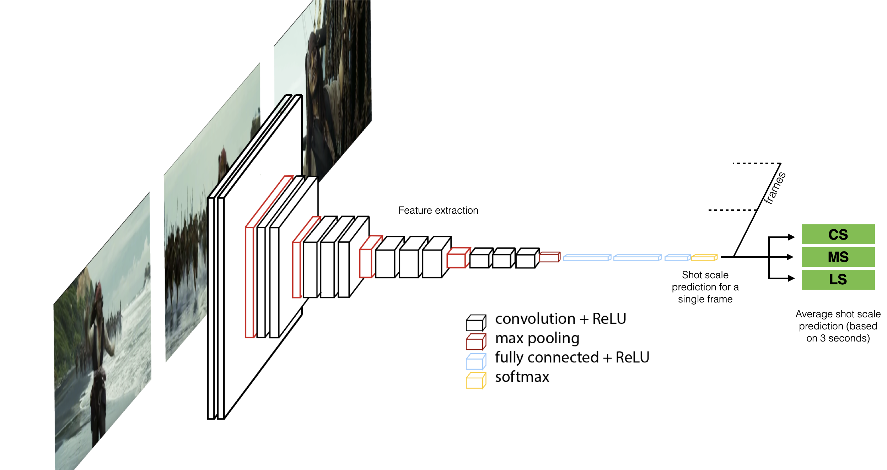

<!-- #region -->
# Recognition


## What is the aim?
<div class="columns is-mobile is-centered is-vcentered">
  <div class="column is-4">
    <span>Insert a brief decription of the aims
      </span>
  </div>
  <div class="column">
    
  </div>
</div>

[Paper (preprint)](#TBD){: .button}


<!-- #endregion -->

## Dataset

<!-- #region -->
We collect a large dataset of shot frames (<b>XXX</b>, with an average of XXX frames) [...]

*Below a list of each field in the* **annotation** file (`XXXXXX.csv`), *with explanations where relevant*
<details>
 <summary>Scheme (click to open)</summary>
    <table>
  <thead>
    <tr>
      <th>Attribute</th>
      <th>Description</th>
    </tr>
  </thead>
  <tbody>
    <tr>
      <td>time</td>
      <td>Time from the movie beginning</td>
    </tr>
    <tr>
      <td>shotscale</td>
      <td>Shot scale class, see next table </td>
    </tr>
  </tbody>    
    </table>
    
 
 <table>
  <thead>
    <tr>
      <th>Code</th>
      <th>Abbreviation</th>
      <th>Class</th>
    </tr>
  </thead>
  <tbody>
    <tr>
      <td>0</td>
      <td>FS</td>
      <td>Foreground Shot</td>
    </tr>
    <tr>
      <td>1</td>
      <td>ECU</td>
      <td>Extreme Close Up</td>
    </tr>
    <tr>
      <td>2</td>
      <td>CU</td>
      <td>Close Up</td>
    </tr>
    <tr>
      <td>3</td>
      <td>MCU</td>
      <td>Medium Close Up</td>
    </tr>
    <tr>
      <td>4</td>
      <td>MS</td>
      <td>Medium Shot</td>
    </tr>
    <tr>
      <td>5</td>
      <td>MLS</td>
      <td>Medium Long Shot</td>
    </tr>
    <tr>
      <td>6</td>
      <td>LS</td>
      <td>Long Shot</td>
    </tr>
    <tr>
      <td>7</td>
      <td>ELS</td>
      <td>Extreme Long Shot</td>
    </tr>
    <tr>
      <td>8</td>
      <td>IS</td>
      <td>Insert Shots</td>
    </tr>
    <tr>
      <td>9</td>
      <td>NA</td>
      <td>Not available</td>
    </tr>
  </tbody>    
 </table>
</details>
<br />
<!-- #endregion -->

<!-- #region -->
<section class="showcase">
    <div class="showcase-content">
    <h4 id="get-the-data">Get the data</h4>

Please read the Research Use Agreement provided below. 
        
<pre class="highlight" style="white-space: pre-wrap">
<b>Dataset Research Use Agreement</b>

<div style="text-align: left">
<b>Premise</b>: this project involves a set of activities aiming at AI-driven interpretation of cinematic data. The research activities are conducted by the Department of Information  Engineering (DII) of the University of Brescia, Brescia, Italy (UniBS).
The dataset is a collection of images and related data and metadata that is made accessible for Research use only, starting from this website and after acceptance of the following terms of use. 

<b>By registering for downloads, you are agreeing to this:</b>

1.	Permission is granted to view and use the Dataset without charge for research purposes only. Its sale is prohibited. Any non-academic research use need to be evaluated case by case by the DII. If you intend to use this Dataset for any non-academic research use, you need to communicate it describing the intended use and receive approval by the DII.
2.	In agreement with the mission of UniBS to promote the publication of scientific knowledge as open data, any computational model or algorithm that have used the Dataset and is publicly referenced (e.g. in a publication etc..) is suggested to be shared including the code and model weights and any case will give appropriate credit by correctly citing the CineScale project scientific papers, but not in any way that suggests that UniBS endorses you or your use.
3.	Other than the rights granted herein, UNIBS retains all rights, title, and interest in the Dataset.
4.	You may make a verbatim copy of the "CineScale Dataset" for uses as permitted in this Research Use Agreement. If another user within your organization wishes to use the Dataset, they must comply with all the terms of this Research Use Agreement.
5.	YOU MAY NOT DISTRIBUTE, PUBLISH, OR REPRODUCE A COPY of any portion or all of the Dataset to others without specific prior written permission from the DII.
6.	You must not modify, reverse engineer, decompile, or create derivative works from the Dataset. You must not remove or alter any copyright or other proprietary notices in the Dataset.
7.	THE Dataset IS PROVIDED «AS IS,» AND UNIBS AND ELTE DO NOT MAKE ANY WARRANTY, EXPRESS OR IMPLIED, INCLUDING BUT NOT LIMITED TO WARRANTIES OF MERCHANTABILITY AND FITNESS FOR A PARTICULAR PURPOSE, NOR DO THEY ASSUME ANY LIABILITY OR RESPONSIBILITY FOR THE USE OF THIS Dataset.
8.	Any violation of this Research Use Agreement or other impermissible use shall be grounds for immediate termination of use of this Dataset. In the event that UniBS determines that the recipient has violated this Research Use Agreement or other impermissible use has been made, they may direct that the undersigned data recipient immediately return all copies of the Dataset and retain no copies thereof even if you did not cause the violation or impermissible use.
9.	You agree to indemnify and hold UniBS harmless from any claims, losses or damages, including legal fees, arising out of or resulting from your use of the Dataset or your violation or role in violation of these Terms. You agree to fully cooperate in UniBS defense against any such claims.
</div>

</pre>
</div>
</section>

[Download](#TBD){: .button .is-success .is-medium}


## Results

...

## Get the model

<div class="columns is-mobile is-centered is-vcentered">
  <div class="column is-5">
      
  </div>
  <div class="column">
    <span>
        Hereafter, you can find a convenient jupyter notebook with a demo. It is included an updated version of the model that makes use of [....] <br /><br />
        <a href="model/XXXXXXX.ipynb" class="button is-primary is-outlined is-medium">Jupyter notebook</a>
        <a href="model/XXXXX.h5" class="button is-info is-outlined is-medium">Model weights</a>
    </span>
  </div>
</div>


## Citations

For any use or reference to this project please cite the following papers.

```
@INPROCEEDINGS{
  TBD
}
  
```
